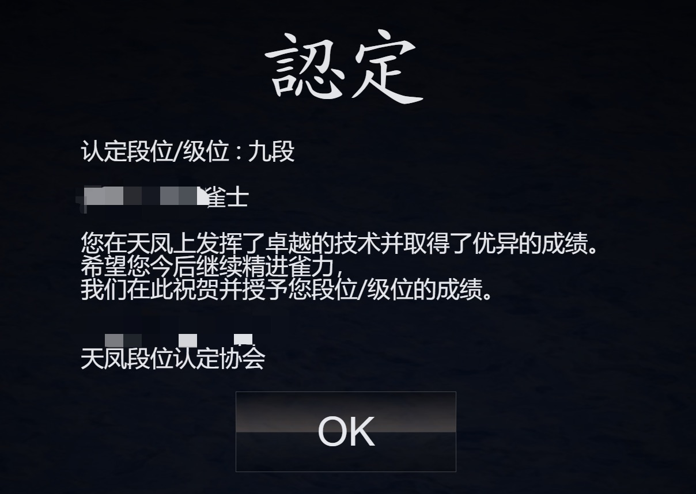
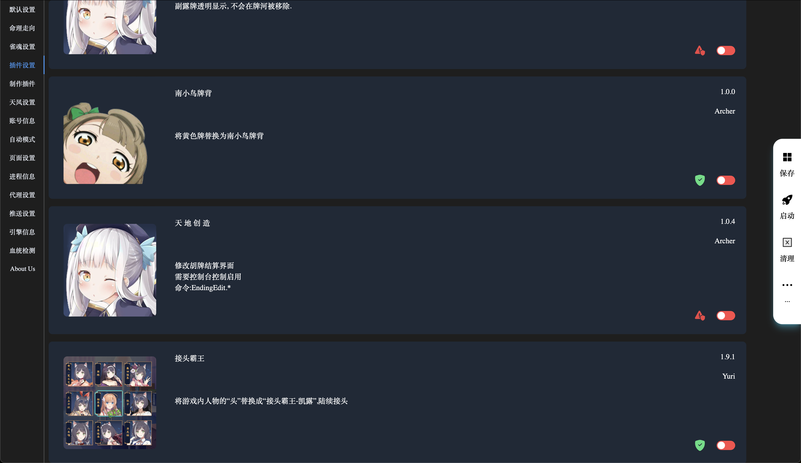
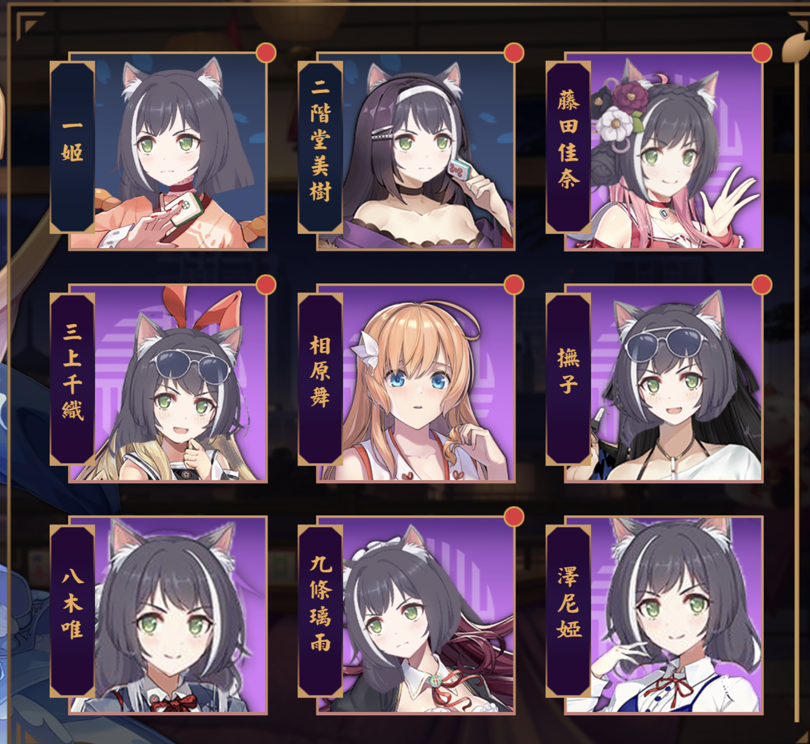
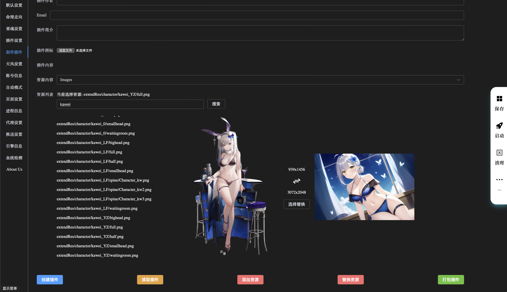

## Archer

Archer是一款基于Mahjong Soul、Tenhou的开发框架，通过该框架可以实现与游戏进行通信、自动化操作游戏、替换游戏立绘资源等行为。

To view the English README, please click [here](./README_EN.md).

[Stable： ](https://github.com/moxcomic/archer/releases/latest)

[Plugin：](https://github.com/moxcomic/archer/releases/plugin)

**警告** 在您使用 Archer 时 **「 可能会导致账号被封禁** ，因此产生的一切后果，Archer 不对此承担任何责任！**如果你比较在意您的账号** 请 **「尽量使用小号」** 使用本软件！

## AI段位

**Archer**在**目前**达到的最高段位为**「天凤九段」**，**雀魂**段位由于部分因素**「暂时无法公开」**相关信息。

## 安装

1. 访问 [releases 页面](https://github.com/moxcomic/archer/releases/latest) 下载适用于您计算机系统的版本
2. 解压压缩文件
3. 运行应用程序，软件会自动启动浏览器(如果没有启动可以手动访问 [http://localhost:30010/webui](http://localhost:30010/webui))

## 自动化操作

- [Wiki](https://github.com/moxcomic/archer/wiki)
- [教程](https://github.com/moxcomic/archer/blob/main/lesson/Navigation.md)

## 插件模组

**Archer** 可以 **「加载」**用户自定义的**「插件模组」**，在打开软件的**「WebUI」**页面后可以看到**「插件设置」**页面即可看到加载的所有插件

**注意:** 部分插件需要**「开启」**自动设置下的**「内建模式」**后才会生效，资源替换类插件**「首次开启」**需要**「进入游戏并退出一次」**才会生效。

插件的右下角有 **「两个重要信息」**

**「绿色盾牌」**代表该插件为**「安全插件」**

**「红色感叹号」**代表该插件**「存在风险」**

**注意:** 这里的风险**「仅代表」**该插件**「可能存在风险」**并不代表其一定会导致账号被封禁。

**目前插件可以做到替换游戏立绘例如下图演示**

**以及修改游戏行为例如下图演示**

**玩家们可以充分的发挥自己的想象力创建更多有趣的插件**

**Archer**官方维护的插件列表可以在 [这里查看](https://github.com/moxcomic/archer/releases/tag/plugin)

**如果对插件有任何疑问、改进方案请留言咨询或者添加下方我们的联系方式**

## 制作插件模组

**Archer**内部提供了一个**「简单」**的**「插件模组制作工具」**，玩家们可以通过其**「快速」**的进行制作**「立绘替换」**类插件模组的制作，如下图所示

## 关于插件模组的安全性

- **所有「资源替换」类插件**模组均为**「安全」**插件模组

目前我们已经内部已经对**「绝大部分插件模组」**进行了为期**「长达半年以上」**的对局测试，**「目前暂无封号情况」**，**「但不代表其没有任何风险」**，后续如果有其它情况我们会另行通知，**「如果您比较在意这些情况请尽量使用小号」**。

## 参与讨论

X (Twitter)： [https://x.com/yuukiasunahk](https://x.com/yuukiasunahk)

QQ群：[813043834](http://qm.qq.com/cgi-bin/qm/qr?_wv=1027&k=lpj-aL7OUe2vy5rSo13Pb-L5nPpLn1SQ&authKey=tlxLDUf6SOkh%2BJtfmgzYW9Ff0oScjghCKMLNRlLUuo1HKBZOk%2BHlfiVi9d05n2LX&noverify=0&group_code=813043834)

<figure class="two">
    
    
</figure>