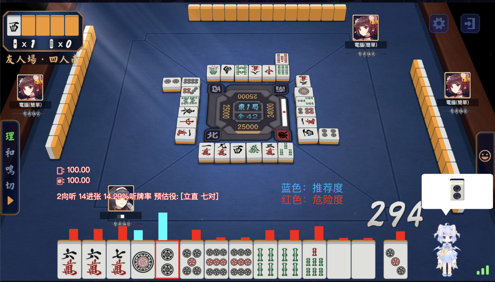

# Archer
Archer is a top-notch Mahjong AI development framework that supports development in `Golang` and `JavaScript`. Through scripting, it offers limitless possibilities. The design of this project is as simple as possible and does not require setting too many options. Everything can be achieved through scripting. If you know how to develop scripts, it will fulfill everything you need, `Your new superpower`.

## Wiki

For more development documentation, please visit [https://github.com/moxcomic/archer/wiki](https://github.com/moxcomic/archer/wiki) or leave an issue there.

## Preview

Archer allows you to focus more on the game page. It can directly display recommended information at a higher level in the game without needing to pay attention to any other information. Moreover, its installation and use do not require any complicated procedures. You only need to click on the "🚀" icon to start, without any cumbersome additional operations. This ease of use is unmatched by any other software currently available in the market.

Archer's image display is independent of the game and has no connection with the game itself. They are separate, belonging to software independently developed by Archer. You can think of it as a standalone application. It is designed to be fixed on the topmost layer of the screen. You can use the shortcut key Ctrl + I to configure whether your mouse can click through the software to interact with the game page.

## Milestone:

2023-12-27: In Tenhou, breakthrough from 8-dan to 9-dan.

2023-12-25: As Christmas approaches, we have completed our final test for 2023. This test still achieved the Tenhou 8-dan rank, but the performance was better than in 2022. In 2024, we will strive for even higher ranks.

2023-11-15: Through our continuous efforts, we have successfully reduced the probability of account bans to below 1%, achieving a record of only 7 bans in 9 months.

## Contact Us

<figure class="two">
    
    
</figure>
