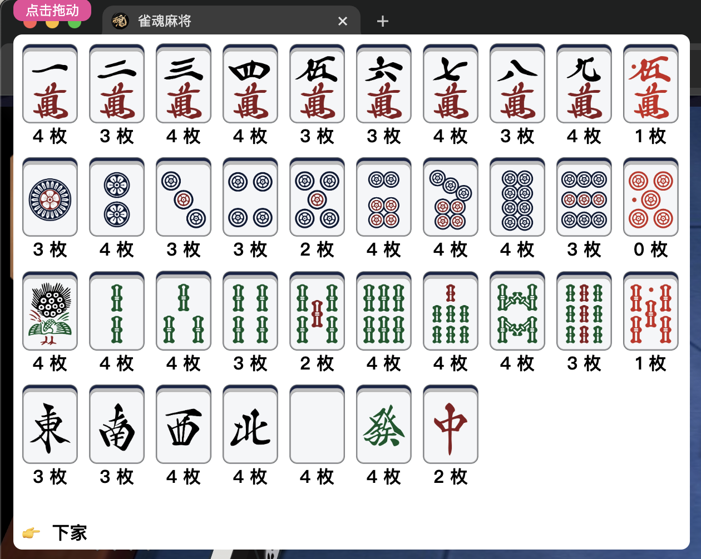
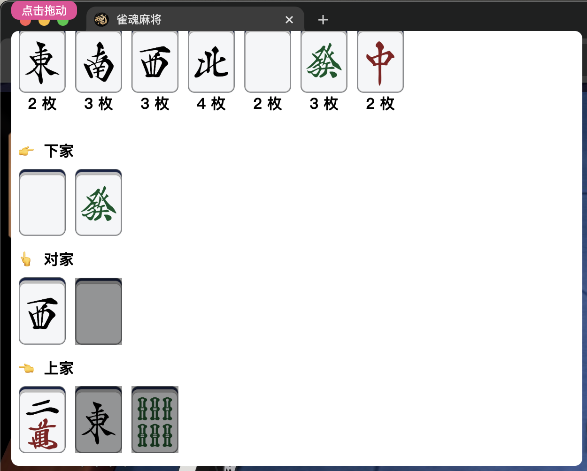

## FAQ

Q: Why not open source the code?

A: Open sourcing is a grace, not open sourcing is a duty. I do not believe that open sourcing this type of software is a good act, whether it is out of interest or other purposes. Your open source code will be targeted by speculators for secondary sales to gain profits, and their sales targets are unaware of the original author. (Especially on Chinese platforms like Taobao, Xianyu, etc.)

Q: Why isn't Archer freely available?

A: To combat the speculators mentioned in the previous question who engage in secondary sales for profit, we have deployed the core code on remote servers. Archer operates on as many as seven remote servers, which represents a significant expense. Additionally, we currently have more than 70 AI engines and are continuously training them without almost any pause, leading to substantial electricity bills. Furthermore, the cost of manual maintenance is also significant, which is why we cannot make it freely available.

Q: Is the Archer service stable?

A: Archer operates on a network of seven remote servers and is developed using the relatively stable `Golang` language. It has been running smoothly for five years now.

Q: Does Archer provide an automatic game mode?

A: To protect your account security, we only offer callable `golang` and `javascript` API interfaces. You can implement an automatic game mode by calling these interfaces.

Q: What language do you recommend for writing scripts?

A: We currently support three development languages: `Golang`, `JavaScript`, and `Python`. However, we recommend using `Golang` for writing scripts because this project is developed in `Golang`, which results in higher compatibility. If you use the other two languages, you might encounter some issues.

## Wiki

For more development documentation, please visit [https://github.com/moxcomic/archer/wiki](https://github.com/moxcomic/archer/wiki) or leave an issue there.

## Preview

Archer allows you to focus more on the game page. It can directly display recommended information at a higher level in the game without needing to pay attention to any other information. Moreover, its installation and use do not require any complicated procedures. You only need to click on the "🚀" icon to start, without any cumbersome additional operations. This ease of use is unmatched by any other software currently available in the market.

Archer's image display is independent of the game and has no connection with the game itself. They are separate, belonging to software independently developed by Archer. You can think of it as a standalone application. It is designed to be fixed on the topmost layer of the screen. You can use the shortcut key Ctrl + I to configure whether your mouse can click through the software to interact with the game page.

[Video](https://moxcomic.github.io/archer/)

## Assassin Extension

The Assassin extension displays in real time the remaining count of Tiles in the current game, as well as the Discard information of the other players, excluding oneself. The gray color indicates Tsumogiri, meaning the Tile that was just dealt is immediately discarded. This extension will not obstruct your table information; by clicking anywhere on the extension, it will minimize to a floating icon in the top left corner. When you need it, simply click this floating icon to restore the display.

## Milestone:

2024-03-28: "Shurima! Your emperor has returned!"

2024-03-26: `Archer` will be the first player to make a run for Tenhou's 10-dan, following `Naga`, `Suphx`, and `LuckyJ`, true to its name, charging forward bravely.

2024-03-25: A major event is about to happen...

2024-03-20: To further enhance the strength of our engine, we have developed a real-time training method. After the update on March 20, 2024, we will allow AI-completed real-time matches to be incorporated into training to more quickly improve the engine's self-strength. Unlike any previous training methods, the goal of this training is to allow the engine to gain more realistic match information in real-time games to improve its own judgment. Due to the large demand for data and the lower efficiency of real-time match training, we may need more time to conduct this training.

2024-03-17: We have confirmed that over the same dataset of 1,000 games, we have surpassed `LuckyJ`. Moreover, we spent several months competing against other AI on the market (such as NAGA) in thousands of matches and have gained a leading advantage. However, since our emails to Tenhou have gone unanswered for four months, we will not disclose any other related information until our testing is complete. Therefore, to facilitate testing, the information we release is delayed; this is a message from the distant past... Given the considerable time required to train transformers, we anticipate needing to continue iterations over the next two years.

2024-03-15: After years of accumulation, we made significant progress recently.

2024-03-10: Our training equipment has been continuously operating 24 hours a day for 4 months, from November 6, 2023, to the present date, March 10, 2024. Except for unavoidable circumstances like power outages, it has been in continuous training. We anticipate it will need to remain in service for at least another 2 years, with electricity costs being a significant expense.

2024-03-06: We conducted 170 matches on Tenhou with our latest engine against the Mortal 4.0 strongest model, achieving an average rank of 2.3823, sounds pretty good.

2024-01-26: Since we have not yet obtained permission from the Tenhou platform, we may not disclose effective information so soon. We will make the relevant information public when we determine that everything is complete.

2024-??-??: Achieving 10-dan in Tenhou, we will announce the results after some time. Currently, we need to organize some data and cannot disclose it publicly yet.

2023-12-25: As Christmas approaches, we have completed our final test for 2023. This test still achieved the Tenhou 8-dan rank, but the performance was better than in 2022. In 2024, we will strive for even higher ranks.

2023-11-15: Through our continuous efforts, we have successfully reduced the probability of account bans to below 1%, achieving a record of only 7 bans in 9 months.

## Contact Us

<figure class="two">
    
    
</figure>
