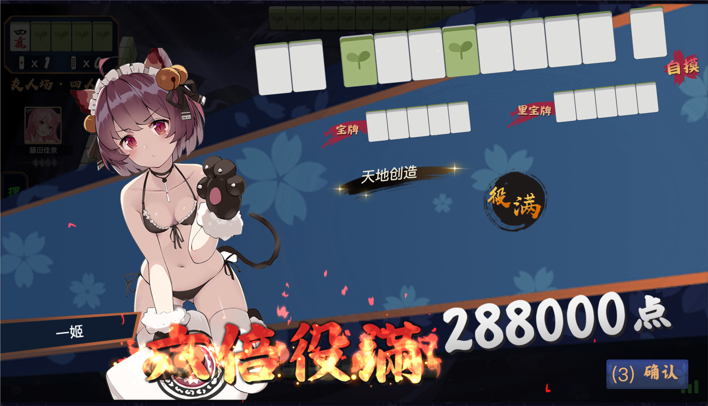

## Archer

Archer is a development framework based on Mahjong Soul and Tenhou. Through this framework, you can achieve communication with the game, automate game operations, replace game artwork resources, and more.

[Stable: ](https://github.com/moxcomic/archer/releases/latest)

[Plugin: ](https://github.com/moxcomic/archer/releases/plugin)

**Warning:** Using Archer **"may result in account bans"**. Archer takes no responsibility for any consequences arising from its use! **If you are concerned about your account**, please **"try to use a secondary account"** when using this software!

## AI Rank

The highest rank currently achieved by **Archer** is **"Tenhou 9 Dan"**. Due to certain factors, the rank information for **Mahjong Soul** is **"temporarily undisclosed"**.

## Installation

1. Visit the [releases page](https://github.com/moxcomic/archer/releases/latest) to download the version suitable for your computer system.
2. Unzip the file.
3. Run the application. The software will automatically launch a browser (if it doesn't, you can manually visit [http://localhost:30010/webui](http://localhost:30010/webui)).

## Automation

- [Wiki](https://github.com/moxcomic/archer/wiki)
- [Tutorials](https://github.com/moxcomic/archer/blob/main/lesson/Navigation.md)

## Plugin Modules
**Archer** can **"load"** user-defined **"plugin modules"**. After opening the **"WebUI"** page of the software, you can see the **"Plugin Settings"** page to view all the loaded plugins.

In the bottom right corner of the plugin, there are **"two important pieces of information"**:
**"Green Shield"** indicates that the plugin is a **"safe plugin"**.
**"Red Exclamation Mark"** indicates that the plugin **"may pose a risk"**.
**Note:** This risk **"only represents"** that the plugin **"may pose a risk"** and does not necessarily mean it will result in an account ban.

**Currently, plugins can replace game artwork as demonstrated below**:

**And modify game behavior as demonstrated below**:

**Players can fully utilize their imagination to create more interesting plugins**.

The list of plugins maintained by the **Archer** official team can be viewed [here](https://github.com/moxcomic/archer/releases/tag/plugin).

**If you have any questions or improvement suggestions regarding the plugins, please leave a comment or contact us using the information below**.

## Creating Plugin Modules

**Archer** provides an **"easy"** **"plugin module creation tool"**. Players can **"quickly"** create **"artwork replacement"** plugin modules using this tool, as shown below:

## Join the Discussion

X (Twitter): [https://x.com/yuukiasunahk](https://x.com/yuukiasunahk)

QQ Group: [813043834](http://qm.qq.com/cgi-bin/qm/qr?_wv=1027&k=lpj-aL7OUe2vy5rSo13Pb-L5nPpLn1SQ&authKey=tlxLDUf6SOkh%2BJtfmgzYW9Ff0oScjghCKMLNRlLUuo1HKBZOk%2BHlfiVi9d05n2LX&noverify=0&group_code=813043834)

<figure class="two">
    
    
</figure>