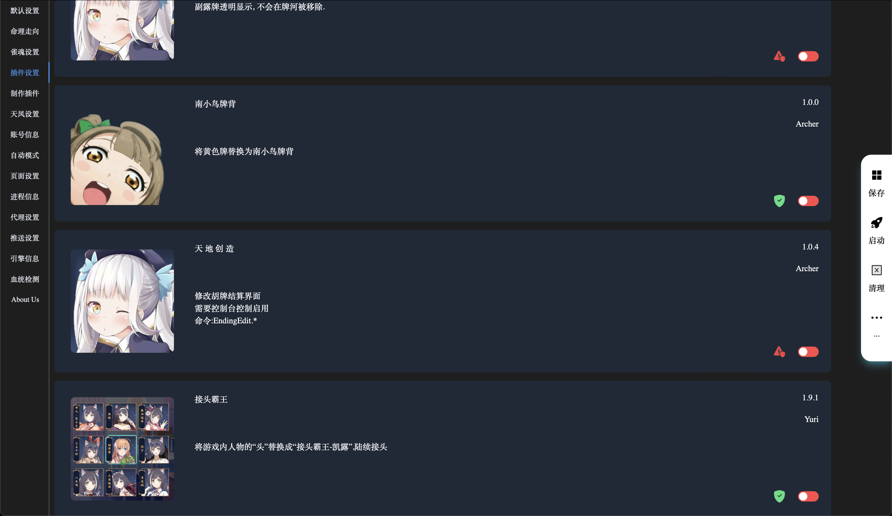
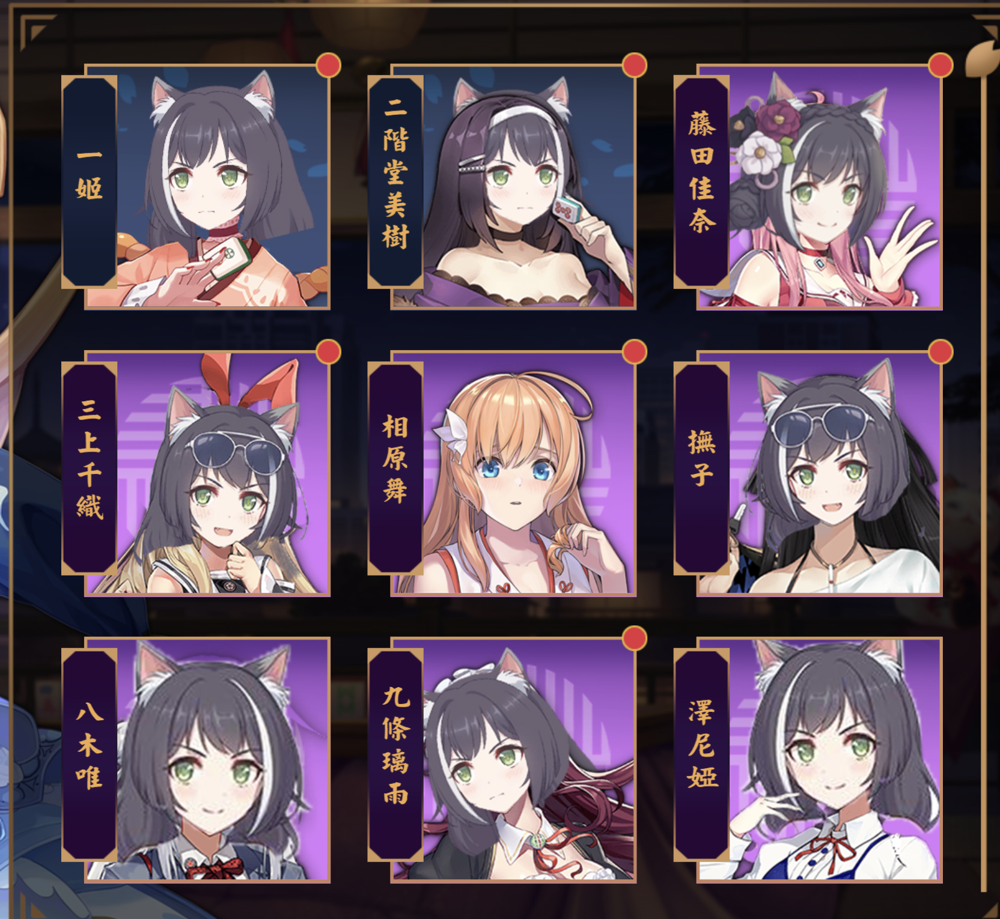
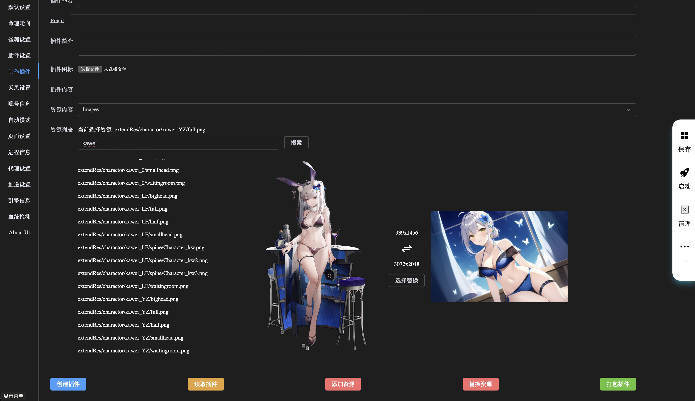

## Archer

Archer is a development framework based on Mahjong Soul and Tenhou. Through this framework, you can achieve communication with the game, automate game operations, replace game artwork resources, and more.

To view the English README, please click [here](./README_EN.md).

[Stable: ](https://github.com/moxcomic/archer/releases/latest)

[Plugin: ](https://github.com/moxcomic/archer/releases/plugin)

**Warning:** Using Archer **"may result in account bans"**, and Archer takes no responsibility for any consequences arising from its use! **If you are concerned about your account**, please **"try to use a secondary account"** when using this software!

**Note:** This software does not offer a free version. If you cannot accept this, please do not download or use it. If you live in a parallel world where everything is free, or if Cook gives you 10 free iPhones every year, we might consider it. We are not philanthropists. The maintenance costs of the software and the electricity expenses for training machines are substantial, and we currently do not have the capacity to bear these costs.

**Warning:** Due to the high entry threshold and the need for specialized knowledge, less experienced computer users should consider carefully, as you might not understand how to use the software.

## AI Rank

The highest rank currently achieved by **Archer** is **"Tenhou 9 Dan"**. Due to certain factors, the rank information for **Mahjong Soul** is **"temporarily undisclosed"**.

## Installation

1. Visit the [releases page](https://github.com/moxcomic/archer/releases/latest) to download the version suitable for your computer system.
2. Unzip the file.
3. Run the application. The software will automatically launch a browser (if it doesn't, you can manually visit [http://localhost:30010/webui](http://localhost:30010/webui)).

## Automation

- [Wiki](https://github.com/moxcomic/archer/wiki)
- [Tutorials](https://github.com/moxcomic/archer/blob/main/lesson/Navigation.md)

## Plugin Modules

**Archer** can **"load"** user-defined **"plugin modules"**. After opening the **"WebUI"** page of the software, you can see the **"Plugin Settings"** page to view all the loaded plugins.

**Note:** Some plugins require **"enabling"** the **"Built-in Mode"** under automatic settings to take effect. Resource replacement plugins **"need to be launched"** and you must **"enter the game and exit once"** for them to take effect the first time.

In the bottom right corner of the plugin, there are **"two important pieces of information"**:

**"Green Shield"** indicates that the plugin is a **"safe plugin"**.

**"Red Exclamation Mark"** indicates that the plugin **"may pose a risk"**.

**Note:** This risk **"only represents"** that the plugin **"may pose a risk"** and does not necessarily mean it will result in an account ban.

**Currently, plugins can replace game artwork as demonstrated below:**

**And modify game behavior as demonstrated below:**

**Players can fully utilize their imagination to create more interesting plugins.**

The list of plugins maintained by the **Archer** official team can be viewed [here](https://github.com/moxcomic/archer/releases/tag/plugin).

**If you have any questions or improvement suggestions regarding the plugins, please leave a comment or contact us using the information below.**

## Creating Plugin Modules

**Archer** provides an **"easy"** **"plugin module creation tool"**. Players can **"quickly"** create **"artwork replacement"** plugin modules using this tool, as shown below:

## Showcase of Excellent Plugin Modules

- DNF Music: [https://b23.tv/txSg7Vv](https://b23.tv/txSg7Vv)

## About the Security of Plugin Modules

- **All "resource replacement" plugin modules** are considered **"safe"** plugins.

We have internally tested **"the vast majority of plugin modules"** for **"over six months"** in games, and **"currently there are no account bans"**, **"but this does not mean there is no risk"**. If there are any other issues, we will notify you separately. **"If you are concerned about these issues, please try to use a secondary account"**.

---

## Join the Discussion

